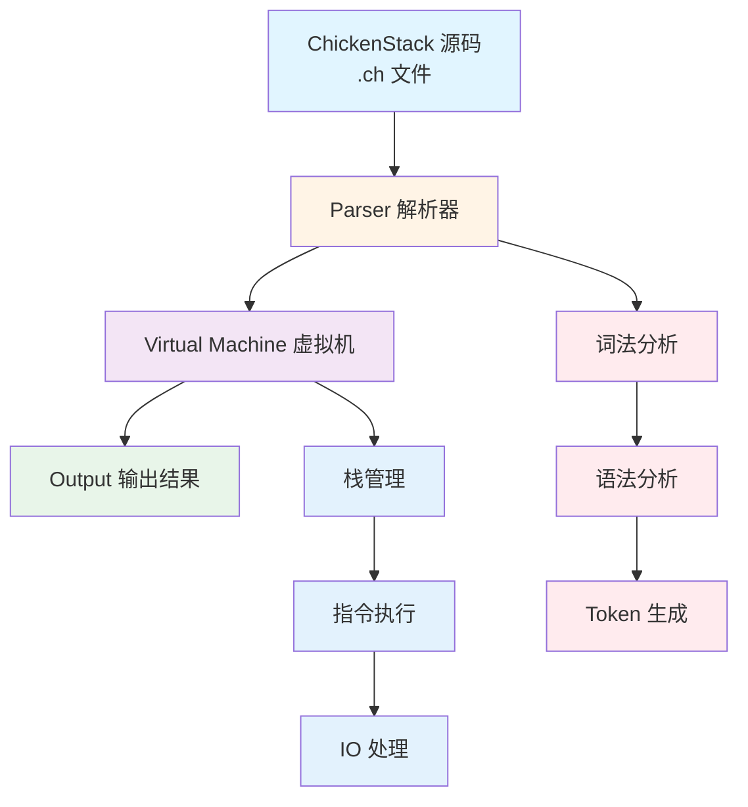

<div align="center">

# ChickenStack

_A Turing Complete Stack-Based Programming Language_

> The depth of the stack is immeasurable, and the beauty of code lies in simplicity.

---

**Read this in other languages: [English](./README.md), [中文](./README_zh.md).**


<div style="text-align: center">
<strong>
<a href="#-quick-start">🚀 Quick Start</a> |
<a href="#-features">✨ Features</a> |
<a href="#-documentation">📚 Documentation</a> |
<a href="#-examples">💡 Examples</a> |
<a href="#-contributing">🤝 Contributing</a>
</strong>
</div>

</div>

---

## 🎉 Introduction

**🐔 ChickenStack is a simple, elegant, and powerful stack-based programming language using Reverse Polish Notation (RPN) syntax.**

- 💭 **Minimalism**: Only 8 basic instructions, each with clear semantics
- 💭 **Stack-Based Thinking**: All operations are performed on the stack, following functional programming principles
- 🧠 **Educational Value**: Perfect for learning about stack data structures, compiler principles, and programming language design
- 🤔 **Turing Complete**: Supports mathematical operations, loops, logic judgments, and can compute any computable function
- 🔌 **Python API**: Provides Python API for easy integration into Python projects
- 💝 **Cross-Platform**: Supports Windows, Linux, macOS and other mainstream operating systems

## 🔥 Quick Start

### Installation

```bash
git clone https://github.com/llz162652/ChickenStack.git
cd ChickenStack
pip install -r requirements.txt
```

### Hello World

Create `hello_world.ch` file:

```ch
72 " 101 " 108 " 108 " 111 " 32 " 87 " 111 " 114 " 108 " 100 " 10 "
```

Run:

```bash
python main.py hello_world.ch
```

Output:

```
Hello World
```

### Advanced Example: Fibonacci Sequence

```ch
0 1 10 [ dup + swap dup 1 - swap 1 - ]
```

## ✨ Features

### Why ChickenStack?

Because this "chicken" (Chicken) will "peck" (Peck) data on the stack, just as simple and natural as pecking rice!

### Core Features

- **Easy to Use**
  - Easy for beginners to use, more human-friendly than Brainfuck
  - Intuitive syntax with a gentle learning curve

- **Turing Complete**
  - Supports mathematical operations, loops, logic judgments, etc.
  - Theoretically capable of writing any program

- **Cross Platform**
  - Supports Windows, Linux, macOS and other mainstream operating systems
  - Pure Python implementation, no compilation required, plug and play

- **Rich API**
  - Provides Python API for easy integration into Python projects
  - Supports custom IO Handler, highly extensible

- **Extensible**
  - Supports custom instructions and IO Handler to meet various needs
  - Can be easily integrated into existing projects

- **Stable and Reliable**
  - Continuous stable development and maintenance
  - Comprehensive test coverage, ensuring code quality

## 📚 Documentation

**For first-time users**, please check the [complete documentation](https://llz162652.github.io/ChickenStack_doc/)

- [Quick Start](https://llz162652.github.io/ChickenStack_doc/guide/installation.html)
- [Instruction Set](https://llz162652.github.io/ChickenStack_doc/guide/instruction-set.html)
- [Syntax](https://llz162652.github.io/ChickenStack_doc/guide/syntax.html)
- [Python API](https://llz162652.github.io/ChickenStack_doc/guide/python-api.html)
- [VM API](https://llz162652.github.io/ChickenStack_doc/guide/vm-api.html)

## 💡 Examples

Check the `examples/` directory for more example code, including:

### Basic Examples
- [Hello World](https://llz162652.github.io/ChickenStack_doc/examples/hello-world.html)
- [Math Operations](https://llz162652.github.io/ChickenStack_doc/examples/math.html)
- [Stack Operations](https://llz162652.github.io/ChickenStack_doc/examples/stack.html)

### Advanced Examples
- [Loops](https://llz162652.github.io/ChickenStack_doc/examples/loops.html)
- [Fibonacci Sequence](https://llz162652.github.io/ChickenStack_doc/examples/fibonacci.html)
- [Factorial](https://llz162652.github.io/ChickenStack_doc/examples/factorial.html)
- [String Reverse](https://llz162652.github.io/ChickenStack_doc/examples/reverse-string.html)
- [Sum](https://llz162652.github.io/ChickenStack_doc/examples/sum.html)
- [Multiplication Table](https://llz162652.github.io/ChickenStack_doc/examples/multiplication-table.html)

## 🏗️ Architecture



## 🗺️ Roadmap

- [x] Basic instruction set implementation
- [x] Python API wrapper
- [x] Complete documentation system
- [x] Performance optimization (38.63% improvement)
- [ ] JIT compilation optimization
- [ ] Web version interpreter
- [ ] More language bindings (JavaScript, Go)
- [ ] IDE plugin support
- [ ] Online code editor

## 🔗 Links

- **📚 Documentation**: [Full Documentation](https://llz162652.github.io/ChickenStack_doc/)
- **🔧 Repository**: [GitHub Repository](https://github.com/llz162652/ChickenStack)
- **💡 Examples**: [Example Code](https://github.com/llz162652/ChickenStack/tree/main/examples)
- **🧪 Tests**: [Test Cases](https://github.com/llz162652/ChickenStack/tree/main/tests)

## 🤝 Contributing

Contributions are welcome! Please check [CONTRIBUTING.md](https://llz162652.github.io/ChickenStack_doc/) to learn how to participate in development.

### Contributors

**AI Developer**
- AI GLM-4.7 - Code generation, testing, documentation, performance optimization

**Human Developer**
- llz162652 - Project planning, code review, requirement definition

Thanks to all the contributors!

<a href="https://github.com/llz162652/ChickenStack/graphs/contributors">
  
</a>

## 🙏 Acknowledgments

- [Brainfuck](https://en.wikipedia.org/wiki/Brainfuck) Inspiration source, showing the charm of minimalist programming languages
- [VitePress](https://vitepress.dev/) Provided excellent documentation building tools
- [MaiBot](https://github.com/MaiM-with-u/MaiBot) Documentation design inspiration
- [Python](https://www.python.org/) Powerful programming language that made ChickenStack possible

**Also thanks to every user who has provided valuable opinions and suggestions for the development of ChickenStack, and thank you for accompanying ChickenStack to where it is today!**

## 📌 Notice

> [!WARNING]
> This repository is for learning and research purposes only. Please comply with local laws and regulations when using it. The user is responsible for any problems caused by its use.

## 📊 Repository Status


### Star History

[](https://starchart.cc/llz162652/ChickenStack)

## 📄 License

This project is open sourced under [MIT License](./LICENSE).

---

<div align="center">

**Made with ❤️ by llz162652**

**If you find it useful, please give a ⭐ Star to support us!**

</div>
